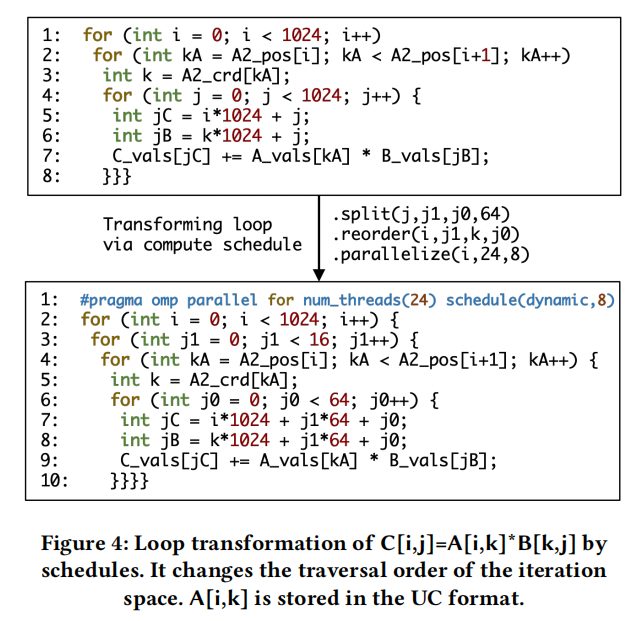

#  WACO

## 总结

**内容和主题**

主要内容应该是优化稀疏矩阵相关的乘法。思路是综合考虑三个方面：

- 稀疏矩阵本身的特征
- 稀疏矩阵存储在内存中的格式 format
- 稀疏矩阵参与运算时的调度 schedule（schedule 如何理解呢？我们随便写一个稠密矩阵乘法，都有 i j k 三层循环，我们可以决定 i j k 这三层循环如何嵌套；也可以决定是否分块，例如对于 i 的循环是否分成 i1-i0 这样的循环结构）

对于稀疏矩阵本身的特征，本文使用了 WACONet。它相比于以往方法，可以更加综合有效的考虑稀疏矩阵本身的特征；同时避免了手工总结特征的不便捷。

稀疏矩阵本身的特征是稀疏矩阵固有的，而稀疏矩阵如何存储（format）和稀疏矩阵如何调度（schedule）是我们可控的。作者将这部分综合成 SuperSchedule。format 使用前人提出的 format abstraction 总结了大量的 format；schedule 同样使用相似的结构，通过参数控制遍历顺序、是否分块等。

介绍完这些之后，我们了解了本文如何把握优化稀疏矩阵的因素。接下来是本文在这些要素的基础上进行优化。整个思路大概可以认为给定一个模型，前期训练这些模型，积累模型关于矩阵特征、format 和 schedule 的知识。随后给定任意一个矩阵之后，可以通过分析它的稀疏格式，选择最优的 format 和 schedule。

整个过程大概分为如下几步：

- 训练一个 cost model。cost model 的作用是接收稀疏矩阵和 SuperSchedule（SuperSchedule 包含 format 和 schedule 信息），输出一个预测结果。cost model 包含三个部分：
  - feature extractor：提取稀疏矩阵本身特征
  - program embedder：提取 format 和 schedule 的信息
  - runtime predictor：训练获得预测结果
- 给一个矩阵，检索最优的 SuperSchedule。这里为了更快检索，使用了 ANNS 算法，将这个最优化问题转化为 Nearest Neighbor Search 问题，其中所有的 Neighbor 就是所有的 SuperSchedule（所有的 SuperSchedule 来自于训练集，而训练集中选择 SuperSchedule 是随机选择的）。为了检索，文中构建了一个 KNN 图，ANNS 应用于 KNN 上可以针对给定的矩阵逐步收敛到局部最优的 SuperSchedule

评估，SuperSchedule 整体运行效果不错，但是适用于同一个矩阵乘法多次运行的情况。因为评估运行时间没有考虑搜索时间和格式转化时间。实际上，WACO 的搜索时间比较长。

**结构和组织**

**文体和语言**

**表达效果**

**适合读者**

**创新与价值**

**文章的亮点和缺点**

format abstraction 声称对于所有稀疏矩阵存储格式做了一层抽象，感觉很有意思，肯定得再看看。

使用 KNN 以及 ANNS 搜索方法，是因为本文声称以往算法主要使用黑盒算法，估计是硬搜的。所以可能时间比较长。

**上下文和背景**

**综合评价**

## Abstract

本文提出了一种在稀疏张量程序中协同优化给定稀疏模式的格式和调度的新方法，WACO。本文最核心的挑战是设计一个轻量级的模型，通过考虑稀疏模式、格式和调度从而准确的预测稀疏向量程序的运行时间。解决这个问题的关键思路（**why**）是利用稀疏卷积网络来学习稀疏模式的有意义的特征，并使用专门设计的调度模板（specially designed schedule template）在格式和调度之间嵌入耦合行为（coupled behavior）。此外，在巨大的协同优化搜索空间内，我们的搜索策略，近似最近邻搜索（an approximate nearest neighbor search），有效和准确地检索给定稀疏模式的最佳格式和调度。我们使用 726 种不同的稀疏性格式在一个 CPU 上针对四种不同算法（SpMV、SpMM、SDDMM 和 MTTKRP）评估了 WACO。实验结果表明，WACO 优于四种最先进的 baseline，Intel MKL、BestFormat、使用默认调度的 TACO 和 ASpT。和四个 baseline 种最佳值相比，WACO 在 SpMV、SpMM、SDDMM 和 MTTKRP 上的平均加速比分别为 1.43x、1.18x、1.14x 和 1.27x。

关键词：Sparse Tensor，Auto-Scheduling，Tensor Compiler

## 1. Introduction

稀疏张量代数是许多领域不可缺少的工具，比如图分析、科学计算和深度学习。密集张量代数只有张量的形状才重要，但是稀疏张量代数中，性能很大程度依赖于张量的稀疏模式。过去几十年中，许多稀疏格式被提出，但是没有一种在所有稀疏格式中都普遍最优的格式。根据稀疏性模式，不同调度从而带来迭代空间的不同遍历顺序，最终会显著影响性能。例如，具有非零偏态分布的稀疏矩阵必须利用细粒度的负载均衡，而粗粒度的负载均衡必须应用非零元均匀分布的稀疏矩阵。

最近 Kjolstad 等人提出了 TACO，这是一个稀疏向量代数的编译器，它通过引入一种**格式抽象**（format abstraction）概括了许多提出的稀疏格式。此外，在 TACO 上实现了一个稀疏迭代空间转换框架（sparse iteration space transformation framework）。这个框架允许编译器生成一个调度代码，执行循环分割、重排、并行化和其他任务，以探索迭代空间的不同遍历顺序。虽然先前的研究已经建立了编译器的机制，使得代码生成能够支持许多不同的格式和调度，但是那个策略——使编译器决定某个稀疏性模式的最佳格式和最佳调度的策略尚未设计出来。不幸的是，一个单一的格式或者固定的实现不可能针对所有稀疏格式都是最优的。因此设计这个 policy，和程序自动调优问题紧密相关。

程序自动调优被大量用于优化稠密向量程序的性能，其性能取决于输入的大小。它始于传统的高性能科学库中，例如 ATLAS 和 FFTW。他们通过经验方式根据跟定的输入转换程序来自动优化。最近，一些语言例如 Halide，Tiramisu 和 TVM 等语言将算法和调度原语（primitives）解耦，从而转换稠密向量程序中循环的结构。这种调度语言（scheduling language）支持非常广泛的算法，但是同时引入了相当大的搜索空间。

自动调优稀疏计算不是最近才开始研究的。即使是生产系统也为稀疏计算引入了自动调优工作流。例如，Intel MKL 使用检测-执行模型（inspector-executor model）来自动调优一些稀疏计算。但是，目前的生产和最先进的研究系统中有如下局限性。

**获取稀疏性模式的局限性。**对于密集张量程序，自动调优器只需要 tensor shape。但是只有形状不足以获得张量的稀疏模式。但是获得整个稀疏模式的代价是很大的，因为非零元数量可能高达数十亿个。为了总结稀疏性模式，需要更多的信息，例如稠密度、稠密块个数、对称性是否存在等。设计一个能够准确总结系数模式的特征对于自动调优的最优决策至关重要。现有方式不能完全捕获这种模式，因为他们要么依赖于手工特征，要么依赖于具有降采样矩阵的卷积神经网络，这两者都会导致稀疏性模式的显著信息丢失。

**缺乏协同优化。**即使在密集张量程序中，数据布局和调度的联合优化也很重要，它比稀疏张量程序更简单。然而，先前稀疏向量程序的自动调优研究主要只解决了两个问题中的一个：选择一个最优的调度或者一个最优的格式。例如 Intel MKL 支持 inspector-executor 稀疏 BLAS 程序，其中 executor 调用 inspector 的调优程序。但是 MKL inspector 会错过优化机会，主要由于它通过固定格式来限制优化空间。为了获得良好的性能，有必要考虑格式和调度之间的组合行为。

**我们的方法。**本文提出了工作负载感知协同优化（Workload-Aware Co-Optimization, WACO），一个自动和联合优化给定稀疏模式的格式和调度的框架。WACO 使用了一个基于深度学习的成本模型，可以准确有效地预测稀疏张量程序的性能。成本模型使用新的稀疏卷积网络，WA-CONet，提取稀疏模式的丰富特征，并使用一个统一的调度模板，SuperSchedule，来理解 format 和迭代空间的遍历顺序。WACO 进一步利用近似最近邻搜索，在巨大的搜索空间上快速搜索最优格式和调度。

总而言之，我们的贡献如下：

- 据我们所知，WACO 是第一个自动调优器，协同优化格式和调度，用工作负载感知的方式。
- WACO 是第一个具有成本模型的自动调优器，综合考虑了稀疏性模式、format 和 schedule
- WACO 引入了稀疏模式提取器 WA-CONet，一个新的稀疏卷积网络架构有效的学习表示稀疏模式的重要特征
- WACO 使用一个快速搜多策略，近似最近邻搜索，ANNS，获得近似最优的 format 和 schedule
- 我们将 WACO 和四种最先进的 baseline 比较，Intel MKL，BestFormat，固定 format 和调度的 TACO 和 ASpT。WACO 在 SpMV、SpMM、SDDMM 和 MTTKRP 上的平均加速比分别为 1.43×、1.18×、1.14×和1.27×，其表现优于4个基线中的最佳值。

### 1.1 Overview of WACO

图 1 展示了 WACO 的概述。我们设计了我们的 cost model 来**预测程序的运行时间**。Cost model 将稀疏矩阵和 SuperSchedule 作为输入（图 1a，详见 4.1 节），SuperSchedule 是是一个统一的模板，定义了数据格式和调度。

通过训练 cost model，WACO 创建了一个 KNN 图，帮助之后的搜索。KNN 图建立在 program embeddings 上，它通过 Program Embedder 均匀采样 SuperSchedules 从而包含了多个 SuperSchedules 信息（图 1b，详见4.2 节）

最后，当输入矩阵时，WACO 使用新的搜索策略，近似最近邻搜索（ANNS）来搜索最优的格式和调度。ANNS 重复地选择下一个候选的 SuperSchedule，使用 KNN 图，并获得该候选的预测运行时间作为反馈，指导它收敛到一个局部最优的 SuperSchedule（图 1c，详见 4.2 节）。

## 2. Motivating Example

本节中，我们会描述 co-optimization 如何影响稀疏向量程序的性能。另外，我们会展示稀疏向量程序的性能强烈地依赖于稀疏格式。这表明了稀疏张量程序强烈需要一个自动调优框架。

### 2.1 Impact of the Co-optimization

表 1 通过比较自动调优在三个不同的调优空间上的结果，展示了稀疏张量程序的协同优化的影响：format-only、schedule-only 以及 format 和 schedule。对于 baseline，我们使用 CSR，并且使用 TACO 提供的默认 schedule。对于 Format-only 优化，我们只调整了格式，并保证迭代顺序和 baseline 相同，except that 我们让遍历顺序调整为与 format 的对齐方式一致。对于 Schedule-only 优化，我们只优化了 schedule 从而转换迭代顺序，同时保证使用 CSR 格式。对于 Format 和 Schedule 协同优化，同时优化了 Format 和 Schedule。

与有限的搜索空间相比，联合优化格式和时间表可以为图 2 中所有矩阵产生显著的加u是。限制优化空间，如选择最优的 format 和最优的 schedule 都可能会错过优化机会。特别是对于 TSOPF，协同优化提高了性能 2 倍，但是仅考虑 format 或者 schedule 都只能产生轻微的性能优化。

### 2.2 Sparsity Pattern-Dependent Nature

稀疏张量程序的性能对于输入矩阵的稀疏模式非常敏感。没有一个数据格式可以针对所有稀疏模式都取得最优性能，即便对于高度优化的手写专家库。表 2 展示了这种性质。我们运行稀疏矩阵-稠密矩阵乘法（SpMM），其 format 和 schedule 针对不同稀疏矩阵优化。正如预期一样，对角线上显示了最好的性能，因为它是对应于输入矩阵的协同优化结果。当应用其他优化时，经常会出现显著的性能下降。

这些例子强有力的说明了需要根据输入稀疏 pattern 协同优化 format 和 schedule。从自动优化的角度来看，与稠密的应用程序相比，有三个挑战：（1）考虑稀疏性模式时，我们的框架应该自动决定（2）以哪个格式存储 tensor 并且（3）应该应用哪些 schedule 来转换迭代顺序。为了解决这些挑战，自动调优程序需要理解稀疏 pattern，format 和 schedule 之间的复杂交互作用。

## 3. Background

本节中，我们描述 TACO 如何生成支持各种 format 个迭代空间转换的代码。然后，我们描述现有的稀疏张量程序自动调优的稀疏 pattern-感知 cost model。

### 3.1 Tensor Algebra Compiler

TACO 是一个系数张量代数 Domain Specific Language（DSL），附带一个编译器，它将算法从数据表示和 schedule 解耦。它的算法由 Einsum 表示法指定，例如 $C[i,j]=A[i,k]*B[k,j]$ 表示一个矩阵乘法。Chou 等人介绍了一种 format 抽象，描述了一个 sparse 张量如何用不同的 format （包含坐标的层次和 level formats）存储（how a sparse tensor is stored in different formats with coordinate hierarchies and level formats）。稀疏张量可以看作是坐标的层次结构，其中每个 level 都以一种级别格式（level formats）存储。Chou 等人提出了 6 个 levels format 来表示不同的 formats，但是==我们主要关注两个 level formats：未压缩（Uncompressed）和压缩（Compressed）。==

**Format abstraction**。图 3 说明了如何使用格式抽象将 CSR 和 BCSR 表示出来。任何稀疏张量都可以看作是一个坐标 hierarchy，这是一个树，其中每个节点包含非零坐标的 level。levels 的顺序（$I \rightarrow J$ or $I_1\rightarrow J_1\rightarrow I_0\rightarrow J_0$）表示张量存储的顺序（例如，row-major 或者 column major）。通过在 hierarchy 中指定所有 formats，我们可以定义一个完整的格式（complete format）。Level format 决定了用于存储该级别的 coordinates 的物理存储。未压缩 level format 存储了该级别的维度（N），并编码了一个密集的坐标间隔[0, N)。压缩 level format 通过显式存储出现在 hierarchy 中的坐标，只存储具有非零元的坐标。level spiltting、level reordering 和 level format selection 的组合可以创建上万个数据表示。例如，图 3b 的层次结构总共可以有 $4!*2^4$ 种表示，其中 $4!$ 表示可能的 level orders，$2^4$ 表示 level format 选择的数量。可以根据层次结构中的 level 数量制定更多的格式。

**通过 schedule 进行迭代空间转换**。除了格式抽象，调度决定了如何通过转换迭代空间来遍历存储在特定格式中的张量。例如图 4，split schedule 将指定的 loop level 拆分成两个嵌套循环，parallelize schedule 控制跨多个线程的负载平衡。良好的转换可以实现并行性和/或更好的数据局部性（例如，寄存器/缓存分块）。然而在稀疏计算中，必须在考虑 format 的同时刻意考虑循环变换。例如，如果循环顺序和 format 的排序不一致，它生成的代码可能涉及低效的遍历过程，例如对 Compressed level format 执行二分查找。因此，自动调优器需要理解 format 和迭代空间的遍历之间的耦合关系。

### 3.2 Cost Model for Auto-Scheduling

在 scheduling languages 中，自动调度是为给定输入寻找最优调度的任务。自动调度主要有两个部分：

- 第一部分是一个 cost model，快速预测程序的性能。
- 第二部分是根据 cost model 寻找最好的调度的搜索策略

尽管实际硬件测量可以作为一种成本来使用，但是它非常耗时，所以设计一个高效和准确的成本模型是至关重要的。对于稀疏张量程序，理解稀疏 pattern 是 cost model 最关键的设计考虑因素。

#### 3.2.1 Sparse Tensor Feature Extraction

在设计稀疏张量程序的 cost model 的时候，常用两种提取稀疏张量特征的方法

- 人为特征（human-crafted features）
- 降采样张量上的卷积网络（a convolutional network over downsampled tensors）

**Human-crafted features. **通过考虑张量的统计特征，人为设计一个特征向量。典型的特征是非零元数目，每行非零元数量的平均值或者方差，如从 DIA 格式到对角线的平均距离。然而，人为制定的特征在确定准确性方面的有效性是未知的。当需要考虑一种新的格式时，还需要重新手动重新设计这些特性。

**Convolutional neural network(CNN).** 另一种方法使用 CNN，将稀疏向量看成一张图片来提取特征。一个稀疏张量可能有多种形状，但由于 CNN 只能接收固定大小的形状作为输入，所以稀疏张量被降采样到一个固定的形状。图 5 说明了张量降采样如何在任意稀疏张量下工作。实际中，稀疏张量通常降采样到 128x128. 为了向 CNN 提供额外的信息，降采样张量后的非零位置可能对应原始多个非零元。然而，随着稀疏张量形状的增加，降采样会导致局部模式信息显著丢失。例如，图 5 中两个矩阵都被降采样到相同的形状。此外，现实世界稀疏张量尺度更大，这是降采样无法帮助的。

上述方法在准确提取稀疏性模式的特征方面存在不足。在人为制定的特征中，不可能在 TACO 的格式抽象中手动设计所有特定于格式的特性。降采样的情况下，它只适用于小的稀疏张量，它只适用于小的稀疏张量，否则他会丢失重要信息，这往往会导致次优决策==（多大算大？）==。

## 4. Workload-Aware Co-Optimization

本节中，我们将介绍 WACO，一个稀疏张量程序的自动调优框架。WACO 会自动从 TACO 可以生成的内容中搜索给稀疏矩阵的最优的 format 和 schedule。

首先，我们将描述 WACO 如何使用一种新的 cost model，该模型可以理解稀疏性模式、格式和调度之间的复杂交互作用（图 1a）。之后，我们将解释 WACO 如何使用一种新的搜索策略 ANNS 有效的在大的搜索空间上搜索（图 1bc）。

### 4.1 Cost Model Design

cost model 有三个部分（图 6）。

- feature extractor：获得输入矩阵的稀疏 pattern
- program embedder：理解 format 和 schedule 之间的耦合行为。
- runtime predictor：通过多个线性 ReLU 层预测运行时间

#### 4.1.1 Feature Extractor: WACONet

**Challenges.** 如 3.2.1 节中所述，提取稀疏模式特征并非微不足道的。本文方法核心是使用一个稀疏 CNN 学习好的特征。本文提出一种新的特征提取器 WACONet，基于稀疏 CNN 和一种新的网络结构。5.3 节中表明 WACONet 相比于传统 CNN 特征提取器来说，提高了 50% 训练和验证的损失（our evalueation shows that WACONet improves the training and validation loss by roughly 50% when compared to a conventional CNN feature extractor. **为什么提高了 loss**）。

**Exploring different architectures.** 我们首先尝试了传统 CNN，它将稀疏矩阵视为密集矩阵。所有 level 都是用非压缩格式存储。但是，随着矩阵大小增加，很快就占满了存储资源。另一种方法是使用递归神经网络，将稀疏张量视为一个坐标序列。然而输入长度增加，神经网络不能记住所有细节。最终我们选择 CNN 作为 feature etractor，但是我们没有使用密集卷积，而是对原始稀疏矩阵本身使用了稀疏卷积。

**Sparse convolutional layer.** 稀疏卷积层（often called as submanifold sparse convolution）对稀疏输入执行卷积操作。稀疏卷积核传统卷积有很大差别。传统卷积可以处理所有的输入激活（input activations），稀疏卷积只有在 filter 中心位于非零元时才能操作（图 7）。这种特殊的行为阻止了 activation 在层堆叠时变得稠密，从而确保计算相对 cheap。但是，当非零元很分散时，这种方法也有问题。如图 8a，这种行为只能捕获局部模式，而不能捕获全局模式，因为非零元的距离不够近，无法传播信息。当非零元足够近时，它显示出了理解三维点云的能力。然而现实世界的稀疏矩阵通常非零元之间相隔的远，我们需要设计一个网络架构来解决这个问题，同时利用稀疏卷积的优势。

**WACONet.** 我们提出了 WACONet，一个新的稀疏 CNN 架构，它可以有效学习稀疏性模式的丰富特征（图 9）。除了第一层，之后我们每一层都使用 strided convolution 并且 filter 大小为 3x3。多个 strided 卷积有利于获得遥远的非零元特征，因为 strided behavior 迫使接受域增加（图 8b）。由于 GPU 内存限制，稀疏卷积层中 channel 数很少，以至于不能拟合一个具有 1000 万非零元的稀疏矩阵，不像一个传统的 CNN 视觉模型（通常 channel 为 256 或 512）。为了补偿 channel 数量限制导致的网络容量的限制，WACONet 在平均池化之后连接了所有 14 个中间结果，而不是使用最后一层的结果。

WACONet 最小化稀疏矩阵的信息损失，因为没有进行任何降采样。由于卷积操作的性质，一个小滤波器识别局部模式，并且通过在多个 strided layers 的时候识别全局模式。此外，通过简单改变 filter 的维数，可以将 WACONet 应用于高维稀疏张量中。第 5 节中，将使用 WACONet 从 2 维和 3 维稀疏张量中识别丰富特征。

#### 4.1.2 Program Embedder: SuperSchedule

考虑 cost model 第二部分：**program embedder**。稠密张量程序中，program embedder 只需要编码低层次循环抽象语法树反应的迭代空间的遍历顺序（program embedder only needs to encode a traversal order of the iteration space reflected by the low-level loop abstract syntax tree）。但是在稀疏张量程序中，program embedder 需要同时编码遍历顺序和 format 从而准确理解他们之间的耦合行为。

**Challenges.** 编码循环顺序并不简单，因为嵌套循环中的层数随着 split schedule 的变化而变化。如图 4，搜索空间也会随着 split 的分割而变大。循环重排的顺序从 $3!$ 变成 $4!$。为了处理由于 split 操作导致的变化，我们采用了模板引导的自动调度（template-guided auto-scheduling）。此外，我们的模板同时指定了 format 和 schedule，并创建了直接嵌入在该模板上的程序。

**SuperSchedule.** 统一的 schedule 模板，我们称之为 SuperSchedule 同时定义了 format 和 schedule。如图 10a 展示了如何在矩阵向量乘法中定义 SuperSchedule 模板。SuperSchedule 包含一个 compute schedule 和一个 format schedule。Compute schedule 定义迭代空间的遍历顺序，format schedule 定义张量如何被存储。Format Schedule 中的 `reorder` 决定了 tensor 的 level order（例如 row-major 或者 column-major），compute schedule 中的 `reorder` 决定了 tensor 的遍历顺序。

 一个观察结果是一个具有多个 splits 操作的 schedule 可以被简化为具有少量 split 的 schedule。这种简化可以通过指定 split size = 1 来实现。例如，可以将 $C[i]=A[i, k]*B[k]$ 转化为 $C[i1,i0]=A[i1,i0, k1, k0]*B[k1,k0]$。在这个 SuperSchedule 中，我们可以通过适当选择 split 大小为 1 来抽样（sample）所有的 schedule

1. $C[i1]=A[i1,k1]*B[k1]$
2. $C[i1,i0]=A[i1,i0,k1]*B[k1]$
3. $C[i1]=A[i1,k1,k0]*B[k1,k0]$
4. $C[i1,i0]=A[i1,i0,k1,k0]*B[k1,k0]$

从这些 split 算法中，SuperSchedule 还可以推导出各种格式。例如，图 3 中的 UC 格式可以通过如下操作推导出来：选择 split 大小为 1 并且指定 level format 为 UC，根据 i1 和 k1 的 level order。相似的，UCUU 格式可以通过如下方式推导出来：选择 split size 大于 1 并且根据 level order 指定 UCUU level format。

SuperSchedule 是一个完全 split 算法视角下的所有可能的 schedule 的超集。例如，图 10 中的 MV 和 MM SuperSchedule 可以分别表示 4 和 8 个分割算法（**why**，因为对于 MV 来说，要么在 i 处 split，要么不 split，有两种选择；对于 k 也同理，所以有 4 种 split 算法。对于 MM 也同理）。但 SuperSchedule 可以表示更多的算法，取决于定义了多少次 splits 操作。==我们选择了每个 dimension 一个 split，因为我们发现多个 split 产生的收益递减。==

**Network architecture.** 这样一个基于模板的 schedule 允许我们更容易的嵌入程序中。SuperSchedule 不是从 low-level 循环抽象语法树中提取循环特征的，而是直接从模板的参数中提取每个循环特征。表 3 描述了在我们的评估中使用的每个 schedule 和它的可能的参数选择。所有参数都是分类的（==这个分类是指选择的情况是固定的种类之一==），除了 `reorder`，它采用了指数排列（==这里所说的指数情况是指它涉及到先后循环的嵌套排列，这个是一个排列问题==）。我们的 program embedder（图 11）使用 SuperSchedule 中的参数，并输出 program embedding。它首先计算参数的嵌入（the embeddings of each parameters）。每个 categorical 参数通过一个可学习的查找表（绿色框），该表将一个 one-hot 的 categorical 参数（这里独热的意思可能是[000…010…0]）映射到一个高维实值向量（high-dimensional real-valued vector）。每个 permutation 参数被转换为相应的 permutation 矩阵（==中文是置换矩阵，是一种系数仅有 0 和 1 组成的矩阵，置换矩阵的每一行和每一列都仅有一个 1，其余元素都是 0。线性代数中，每个 n 阶的置换矩阵都表示一个 n 个元素的排列==）并通过多个线性 ReLU 层（橙色框）。当计算出所有调度参数的 embeddings 时，它们被连接起来，并输入进多层线性 ReLU 层得到最终的 program embedding。

#### 4.1.3 Training Cost Model

**Data generation.** 我们的训练数据是一组元组（Sparse Matrix，SuperSchedule，Ground Truth Runtime）。我们设计的数据集包括多种稀疏格式。我们将 2893 个真实世界的稀疏矩阵通过任意的扩充，生成了 21400 个稀疏矩阵，同时限制行数不超过 131072，非零元个数不超过 1000 万。

对于每个矩阵，我们从 SuperSchedule 中==随机采样 100 种格式和 schedules==。之后，我们使用 TACO 生成对应的程序，循环运行 50 次，记录中位数时间。**我们排除了需要 1 分钟运行时间以上的结果**。我们对评估中使用的三种算法（SpMV、SpMM 和 SDDMM）重复了这个过程，因此我们收集了大约 600 万个元组（每个算法 200 万个元组）。使用 10 个计算节点收集数据集需要两周时间。训练过程中，我们 80:20 的比例划分训练集和验证集。

**Training objective.** 对于给定的输入稀疏矩阵 $m_i$ 和 SuperSchedule $s_j$，我们 cost model 的目标 $\hat y(m_i, s_j)$ 不是准确预测真实时间 $y_{ij}$。而是，我们希望我们的 cost model 学习不同 SuperSchedule 的排名。因此我们使用成对排序损失（pairwise ranking loss）反映 schedule 的性能顺序，而不是 L1 or L2 loss.
$$
L=\sum_{m_i}\sum_{(s_j,s_k)}sign(y_{ij}-y_{ik})*\phi(\hat y(m_i,s_j)-\hat y(m_i,s_k))
$$
其中如果 x 大于 0，sign(x) 等于 1，否则等于 0。$\phi(x)$ 可以被定义为多种函数，比如 hinge 函数 $\max(0, 1-x)$ 或者 $\log(1+e^{-x})$。本文使用 hinge 函数。我们使用 SuperSchedule ($s_j, s_k$) batch size = 32 对每个稀疏矩阵，并使用 Adam optimizer，learning rate = 0.0001。

### 4.2 Efficient Schedule Search via Nearest Neighbor Search

搜索策略也是自动调度的一个重要组成部分。许多 auto-schedulers 或者调优器依赖于黑盒优化算法找到最佳参数。

**Challenges.** 传统的黑盒优化算法非常慢，因为除了评估黑箱（成本模型）之外，他们还需要管理元数据。例如，贝叶斯优化内部训练一个代理模型（surrogate model）便于在简化搜索过程中的流程。本文将 auto-scheduling 问题转化为 Nearest Neighbor Search 问题。然后，我们利用现有的高性能 NNS 库来搜索 SuperSchedule 的最优参数。

在我们的实验中，在两个著名的黑箱优化器 HyperOpt 和 OpenTuner 中占比仅为 3.9% 和 8.1%，我们的搜索策略将比例提高到 93.9%。

#### 4.2.1 Relationship between auto-scheduling and NNS

我们将自动调度简化为 NNS，NNS 定义为：

其中“最近”可以通过各种指标来定义，如欧几里得距离或者余弦相似度。NNS 将检索为给定查询最小化距离度量的点。Auto-schedule 方面，主要目标是找到一个 schedule s，使得给定的输入矩阵 m 最小化预测的运行时 $\hat y(m,s)$。因此，我们将数据集 S 设定为 SuperSchedule 中所有 format 和 schedule，并将查询 q 定义为输入矩阵 m，从而将 auto-schedule 转化为 NNS 问题。将距离矩阵定义为 $\hat y(m,s)$ 则 NNS 会找到 S 中使得 $\hat y(m,s)$ 最小的 s。

**Approximate Nearest Neighbor Search.** 检索一个精确的最邻近点需要对 S 中所有点进行详尽的距离计算。实践中常用近似最近邻搜索（ANNS）。对于一次查询，ANNS 检索 S 的一个子集，加快检索速度。有多种方法可以实现 ANNS，本文选择一种基于图的 ANNS。

#### 4.2.2 Graph-based ANNS

基于图的 ANNS 包含两个阶段：建立一个 KNN 图和检索 KNN 图，如图 1bc 和图 12。

- 第一阶段创建一个 KNN 图，顶点是 SuperSchedule，只有当两个顶点的 program embedding 在$l_2$ 距离上前 k 最近时，两个顶点之间的边才连上。
- 当 input matrix 输入时，开始第二阶段。第二阶段中 ANNS 开始检索图中最小的调度 s。通过在成本降低的方向上遍历 KNN 图。ANNS 可以有效地进行检索，因为它仅便利了预先创建的引导方向的 KNN 图，然而其他黑箱优化则需要 expensive 的元数据更新。

**Discussions.** 构建阶段使用 $l_2$ 距离 $||e(s_i)-e(s_j)||_2$，检索阶段使用 cost。原因是建立在 $l_2$ 距离上的 KNN 图具有性质，针对任意的距离都可以找到前 k 个候选者。第 5.4 节中，我们经验证明了基于图的 ANNS 可以有效地、准确地检索给定输入矩阵的最优 SuperSchedule。

基于图的 ANNS 的直观解释是在离散空间上使用梯度。事实上，我们基于神经网络的 cost model 是可微的，因此我们可以计算出它的梯度。因此，在寻找最佳 SuperSchedule 时，我们可以利用梯度下降找到局部最优调度。然而，不能保证，我们发现的局部最优是一个有效的参数编码（encoding of parameters）。具体来说，大多数基于梯度的搜索最终将使用无效编码的参数，因为我们将 SuperSchedule 的 categorical parameter 编码为独热向量，将 permutation parameter 编码为 permutation 矩阵。另一方面，如果我们构建一个具有有效 SuperSchedule 的 KNN 图，我们可以将 KNN 上的 ANNS 看作是对 valid encoding 的基于梯度的搜索。投影梯度下降是解决这个问题的另一种方法，但是本文实验中没有找到合适的局部最小值。

**Implementation details.** 实践中，ANNS 库构建了 KNN 图的一个变体，并使用复杂的启发式算法遍历它，以提高搜索效率。我们使用一种最先进的图 ANNS 算法，HNSW，实现本文的搜索策略。本文使用我们训练数据集中的 SuperSchedule 来构建这个图。

## 5. Evaluation

### 5.1 Experimental Setup

**Algorithms.** 我们选择了四种稀疏张量代数算法进行计算。所有算法均采用单精度数据进行计算。

- **SpMV($C[i]=A[i,k]*B[k]$):** 稀疏矩阵 A 乘以稠密向量 B，将结果存储在稠密向量 C 中。
- **SpMM($C[i, j]=A[i,k]*B[k,j]$):** 稀疏矩阵 A 乘以稠密矩阵 B，结果存储在稠密矩阵 C 中。稠密矩阵的列数 J 设置为 256，强制稠密矩阵使用 row-major 存储。
- **SDDMM($D[i,j]=A[i,j]*B[j,k]*C[k,j]$):** 执行两个密集矩阵的 B 和 C 的采样矩阵乘法（sampled matrix multiplication）。输出矩阵 D 和输入矩阵 A 都是稀疏矩阵。我们将 B 和 C 的维度 K 设置为 256，并且让 B 使用 row-major 存储，C 使用 column-major 存储。
- **MTTKRP($D[i,j]=A[i,k,l]*B[k,j]*C[l,j]$):** 三维稀疏矩阵 A 和两个密集矩阵 B 和 C 之间执行矩阵化张量乘以 Khatri-Rao 积。我们将 J 设置为 16，两个密集矩阵都使用 row-major。本文遵循之前的方法生成三维稀疏张量的训练数据集。

**Baseline.** 本文将 WACO 与一下四种最先进的 baseline 进行比较。MKL 和 BestFormat 是基于自动调优的 baseline。FixedCSR 和 ASpT 是具有固定 format 和 schedule 的 baseline。

- **MKL:** Intel MKL 稀疏 BLAS 库使用 inspector-executor 模型在一个固定的 format 上自动调优计算。由于其不支持 SDDMM 和 MTTKRP，本文只使用 CSR 合适将其与 SpMV 和 SpMM 进行比较。
- **BestFormat:** 对于给定的稀疏 pattern，BestFormat 会自动从一些候选的 format 中选择适当的 format。候选对象由 WACO 在测试矩阵中的搜索结果中最经常出现的 5 种格式中选择的。本文使用先前的工作预测二维稀疏矩阵或者三维稀疏矩阵的最佳 format。
- **Fixed CSR:** 这是由 TACO 生成的具有固定 format 和 schedule 的代码。我们针对 MTTKRP 使用了 CCC 格式（CSF）对于其他的测试使用 UC format CSR 格式。对于 SpMV, SpMM, SDDMM, MTTKRP 本文将 OpenMP 块的大小设置为 128，32，32 和 32。
- **ASpT:** ASpT 是最先进的稀疏格式，直接重新排序稀疏矩阵，使得部分区域密集。虽然 ASpT 不局限于特定的算法，但我们只将其与 SpMM 和 SDDMM 进行比较，因为这些格式是作者公开发布的唯一格式。

**Implementations.** 本文使用 TACO 为 WACO 已经找到的最佳 format 和 schedule 生成代码。之后，本文使用 icc-2023.3.0 编译生成的代码，同时使用 `-march=native -mtune=native -O3 -qopenmp` 选项。所有的实验都是在一个 dual-socket 上进行的，24 cores，48 threads，2.5 GHz Inter Xeon E5-2680 v3 机器，30MB 的 L3 cache，128G 的主存，Ubuntu 18.04.3 LTS。我们使用 `numactl -interleave=all` 来控制 NUMA 策略。

本文使用 PyTorch 和闵可夫斯基引擎（MinkowskiEngine）实现了稀疏卷积。本文为每个算法训练了四个独立的模型，在一个 GPU NVIDIA GeForce RTX 3090 24GB 上为每个模型训练了多达 70 epochs。

### 5.2 Performance Results

本文首先评估了 WACO 发现的 format 和 schedule 的性能。本文在 726 个未包含在训练数据集上种的真实世界的稀疏矩阵上进行测试。本文选择了少于 1000 万个非零元和少于 10 万行的矩阵。在 WACO 根据 cost model 选择前十个 SuperSchedule，本文在实际硬件测量后报告了最快的 SuperSchedule。在本文的详细解释报告之前，每个算法的加速 geomean 显示在表 4 （vs auto-tuners）和表 5 中（vs fixed implementations）。总的来说，WACO 相比 baseline 表现得更好，因为它成功找到了一个专门的格式，并为每个稀疏矩阵一起调度。这种改进并不局限于特定的算法（**Why**）；WACO 可以为四种算法找到最佳的 format 和 schedule。

图 13 显示了 WACO 在 SpMM 问题中相比于其他 4 个 baseline 的加速比。y 轴表示 WACO 相比于 baseline 的加速。所有的 x 轴都根据加速比排序了。在 y = 1 直线下的点表示 baseline 比 WACO 性能好。对于 MKL 和 BestFormat，这条线下面的矩阵比其他 baseline 要多，因为他们能采用更大比例的搜索空间（虽然还是没有 WACO 大），因此当基于自动调优的 baseline 找到比 WACO 更好的 format 或者 schedule 时，它们在一些 patterns 上表现得更好。

#### 5.2.1 Discussion on Speedup

我们进一步分析了 SpMV、SpMM 和 SDDMM 的加速来源。本文选择了相比于固定 CSR format 加速比大于 1.5 的矩阵，并将加速的因素划分成 5 个类别。表 6 展示了这些分类和比例。

**SpMV** 首先，一半的矩阵受益于选择适当的 OpenMP chunk size，它控制了多个处理器间的负载平衡。另外一半的原因在于使用稠密 block format 形势存储这些矩阵，充分利用了寄存器。稠密的 blocked format 可以用图 3b 的抽象格式表示为 UCU 或者 UCUU。一个违反直觉的因素是非零元数量少于 50% 的 block size 的矩阵加速。通常这样的 format 将会导致不必要的内存增加。然而由于 Intel icc 编译器使用 SIMD 指令的启发式决策，才会加速。令人惊讶的是 WACO 学习了编译器的启发式方法，并有意地选择更大的 block size 从而利用向量存储器，尽管需要的内存增加了。

**SpMM** 和 SpMV 一样，大多数矩阵通过选择适当的 chunk size 提高加速比。除此之外，一些矩阵受益于一个独特的格式，称之为 sparse block format。相比于 dense block format 其中 level of format 的内层是 Uncompressed（例如 UCU 或者 UCUU），sparse block format 的内层是 Compressed（例如 UUC）。将其划分为具有更大 split size 的 Compressed format 有助于提高缓存局部性。例如，当我们将 k（图 2）存储到 k1(U)-i(U)-K0(C) 格式中，通过将 k 分割 16384 时，LLC miss 率从 36% 降低到 7%，性能提高了 2.5 倍。

**SDDMM** 除了更好的负载平衡和 dense block format 之外，SDDMM 还受益于使用 column-major format。SDDMM 和其他算法的一个区别是，SDDMM 中并行化稀疏矩阵的行和列是安全的。而在 SpMV 或者 SpMM 中，并行稀疏矩阵的列效率很低，因为在该维度上需要进行 reduction。因此 WACO 在 SDDMM 上灵活选择 row-major 或者 column-major format，没有任何限制。

### 5.3 Cost Model Exploration

进行实验测试 feature extractor 如何有效地学习稀疏 pattern 有意义的特征。

图 15 显示了四种备选的 cost models，每个模型使用了不同的特征提取器。

HumanFeature 使用简单的统计信息（行数，列数，非零元数量）。

DenseConv 将一个输入矩阵采样到 256 x 256 后，使用传统 CNN。

MinkowskiNet 是一种流行的基于稀疏卷积层的三维点云深度学习模型。由于 GPU 内存大小有限，我们减少了闵可夫斯基网中的 channel 数量，支持一个具有 1000万个非零元的矩阵。

根据结果可见，HumanFeature 相比于其他三个有明显差距。WACONet 和 MinkowskiNet 比 DenseConv 更好，因为 DenseConv 降采样过程中有模式信息的丢失。最后，WACONet 通过 strided 卷积容纳了更遥远的非零元特征，所以相比于 MinkowskiNet 更有意义。

### 5.4 Search Strategy Exploration

（略看）将 ANNS 和其他两个黑核搜索策略比较，HyperOpt 和 OpenTuner。

可以看到 ANNS 搜索速度更快。原因：

- ANNS 不需要任何元数据更新。
- KNN 图建构过程中记忆了所有的 SuperSchedule。不用运行整个 cost model，只需要运行模型的一部分
- 使用 C++ 写的，其他黑箱优化库使用 Python 写的

**Search time breakdown.** WACO 并不会每次对输入矩阵多次运行特征提取。在特征提取阶段需要的时间和矩阵的非零元数量成正比。如图 16b，五个非零元数量不同的矩阵的搜索时间细分。随着非零元数量的增加，特征提取器需要更多时间，稀疏卷积的计算代价取决于非零元数量。

### 5.5 Generalization on Other Hardware

WACO 的 cost model 训练时是特定于硬件的。

如表 7，对角线上的性能最好。

### 5.6 Search Overhead and Usage Scenarios

**Tuning overhead.** WACO 需要更多的时间来获得更好的性能，对于 SpMV 和 SpMM 分别需要重复运行 919 和 101 次来抵消搜索成本。

**Real-world scenarios.** 上表列出了一些需要运行数万次实际应用程序。如果程序，如 page rank，不需要运行很多次，那么使用其他的 auto-tuners 更好。WACO在需要大量运行的场景中是有益的，如网格模拟或GNN。

## 6. Related Works

**Auto-scheduling and cost model.** 

Halide auto-scheduler 使用一个 cost-model 和 hand-crafted program features 并寻找最好的 schedule，通过 beam search。

AutoTVM 使用嵌入了 low level loop AST 的 cost model。搜索空间需要由用户的模板手动定义

Ansor 允许 auto-schedule。

Tiramisu auto-schedule 使用 LSTM 嵌入 low-level loop AST

有许多 cost model 尝试预测 accelerator 上的性能或则和 x86 basic blocks。

这些都试图设计一个 cost model，单独嵌入迭代空间的遍历顺序，通常针对稠密张量程序，WACO 的 cost model 同时考虑稀疏 pattern format 和 schedule。

**Auto-tuning sparse tensor programs.** 之前的 auto-tuner 分为两类：

- format selection 
  - 通过采样
  - 降采样无法很好的获得 pattern 特征
  - 只考虑了简单的 format
  - 而 WACO 考虑了 format abstraction
- schedule optimization
  - 只建议如何转换稀疏循环，没有自动转换
  - WACO 可以自动转换

## 7. Conclusion

This paper presented WACO, a technique co-optimizing the format and the schedule for a given sparsity pattern. In the sparse tensor programs, it is crucial to design the cost model to consider various sparsity patterns. To address this, we proposed a novel feature extractor that employs a sparse convolutional network. Its obtained features were universal across various formats and were useful for predicting the coupled behavior between the format and the schedule. Furthermore, a graph-based ANNS, a discretized version of the gradient-based search, efficiently and accurately finds the best format and schedule in the large search space of the co-optimization.

## Appendix

KNN：K 近邻