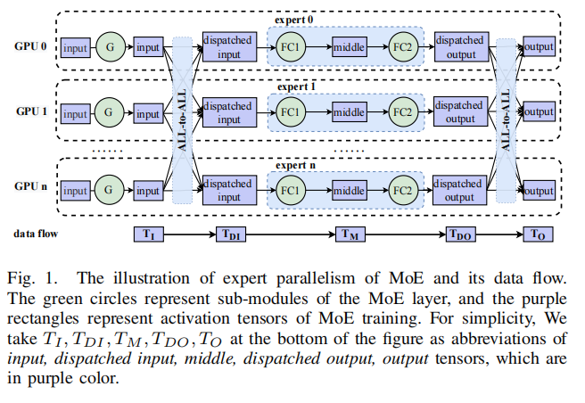
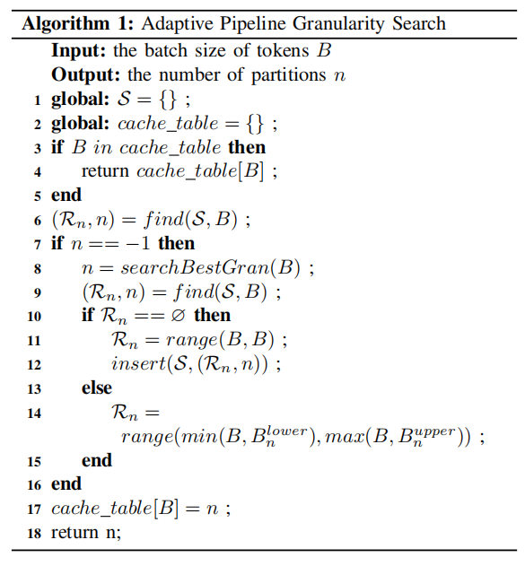

# MPipeMoE

## 总结

**内容和主题**

**结构和组织**

**文体和语言**

**表达效果**

**适合读者**

**创新与价值**

**文章的亮点和缺点**

文章有一些明显错误，比如 $\mu=1$ 写成了 $\sigma=1$

**上下文和背景**

**综合评价**

## Abstract

Mixture-of-Experts 如今非常火热。

> Mixture-of-Experts (MoE) 经典论文一览 - 蝈蝈的文章 - 知乎 https://zhuanlan.zhihu.com/p/542465517
>
> GShard论文笔记（1）-MoE结构 - 立交桥跳水冠军的文章 - 知乎 https://zhuanlan.zhihu.com/p/344344373

但是在通信低效和内存消耗方面还需要解决。

本文中，我们提出 MPipeMoE，是一个高性能库，通过 adaptive 和 memory-efficient pipeline parallelism 加速 MoE。MoE training procedure 可以分为多个独立的子阶段，受到这个启发，我们设计了 adaptive pipeline parallelism，包含一个 online 算法配置 pipeline 的粒度。我们分析了 memory footprint breakdown（内存占用分解），确定了 activations 和 temporary buffers 主要占用了内存。为此，我们提出了 memory reusing 技术，通过消除内存冗余，开发了一个自动选择组件（考虑了硬件容量和模型运行特点）决定最优策略。

我们在 PyTorch 上实现 MPipeMoE 并在 8 个 NVIDIA A100 上评估。和现有方法相比，MPipeMoE 达到了 2.8 倍的加速比，减少 47% 训练大模型的内存。

## 1. Introduction

MoE 可以极大的增加模型大小同时可以避免引入相同比例的计算开销。MoE 包含很多小模型，称为 experts。

（**这篇文章关于图片的很多信息不在正文中说，而是介绍在图注或者表注中。**绿色的圆圈表示 MoE 层的子模块，紫色长方形表示 MoE 训练的 activation tensors。对于具体的符号，T 表示 tensor, I-input, DI-dispatched input, M-middle, DO-dispatched output, O-output）

对于训练 MoE 模型，不同的 experts 分布在很大规模的 GPU 服务器上。训练过程需要 All-to-All 通信原语将 tokens 分给需要的 experts 同时在训练结束之后收回。这个过程称为 expert parallelism，图 1。主要性能瓶颈来自于通信阶段。其中又以 All-to-All 通信占用的多。

训练大型的 MoE 模型需要很大规模的资源。已经有了一些系统和算法的优化解决了 All-to-All 同步通信（synchronous communication）的内在低效问题。

FasterMoE 应用 pipeline parallelism 缓解通信开销。但是它固定了 pipeline 的粒度。实践中，通信具有动态特性，可能需要动态调整 pipeline 粒度。

此外，现有方法忽略了 MoE 中的 memory efficiency，这是 MoE 能否扩展为超大网络的关键。

本文中，我们提出使用整体的方式（in a holistic manner）解决通信低效和 memory usage 的问题。

- 首先，为了减轻通信开销。我们分析系统通信和计算行为、设计自适应的 pipeline 算法，它可以将 batch of tokens 划分为一些 micro-batches，并且重叠通信和计算的执行。
- （和之前方法不同）使用更有效的方式划分 tokens，并且提出了 adaptive configuration algorithm 来搜索最优的 pipeline 粒度。
- 更进一步，我们检测 MoE 训练的 memory footprint，主要来自三个方面
  - model states of experts：包含参数、optimizer states 和 gradients
  - activations：需要存数在 forward pass 中，便于 backward pass 使用
  - temporary buffer：在 backwards 阶段存储 activations 的 gradients，用后就会销毁

其中 activations 是最主要的 memory footprint 的贡献。如图 1，experts 基本平均分布在设备之间，所以每个 experts 相应的参数和状态都平均分布在设备之间，这样减轻了 MoE 的模型状态。但是 activations 和 temporary buffers 还有进一步减少的潜力。

本文提出为不同部分共享相同的缓存区来减少 activation 和 temporary buffer 的 memory footprint。例如 $T_{DI}, T_M, T_{DO}$ 可以从 m 减少为 $\frac{m}{n}$，$m$ 表示内存需求，$n$ 表示分区数（number of partitions），n 决定了 pipeline 的粒度。本文通过 re-computation/communication 和 CPU offloading 技术来恢复 backwards pass 的 activations。如果使用 re-computation 那么可以和通信重叠；此外，利用 GPU 支持 PCIe 的数据传输，我们可以在 forward pass 时将数据放到 CPU 中，然后 prefetch 回 GPU。$T_{DI}$ 可以使用 communication 或者 CPU offloading；$T_M$ 可以 re-computation 或者 CPU offloading。我们建立了一个性能模型来配置运行时的理想策略。

我们做出了以下贡献：

- 我们为 MoE 设计了自适应管道并行性，将 a batch of tokens 划分为多个 micro-batch，并重叠计算和通信的执行，以提高 GPU 和 network bandwidth 的利用率。我们提出了一种在线搜索算法来配置最优的 pipeline 粒度
- 我们分析内存占用，发现 activation 和 temporary buffer 是主要贡献。通过 pipeline parallelism，我们提出通过不同 partition 共享相同的 memory buffer 减少 memory footprint。
- 我们解决了当不同 partitions 需要相同的 memory space 的时候 activation overwritten 的问题。我们利用 re-computation 和 re-communication 和 CPU offload 技术在 backwards 中恢复 activations
- 我们实现并将所提出的技术集成到一个 MoE 训练库中，即 MPipeMoE。实验结果表明，MPipeMoE 可以比最先进的系统 FasterMoE 减少高达47%的内存占用和2.8×的加速。

Section 2 给出 MoE 模型的背景和分布式训练的动机。

Section 3 和 4 描述了 MPipeMoE 的系统设计和实现

Section 5 介绍实验设计和验证结果

Section 6 介绍了相关工作

Section 7 总结全文。

## 2. Background and Motivation

### A. Mixture of Experts (MoE)

Transformer 对于 NLP 的各种任务效果好。大模型的效果也好。MoE 提供了一种有效的方式降低训练大规模模型的成本。

**Expert Parallelism for MoE.** 输入 tensor 首先通过 gating network，它决定使用哪些 expert，之后进行 all-to-all 通信。通信后，每个设备执行 local expert，获得结果后再进行 all-to-all 通信，发送处理好的 tokens 返回原来这些 token 所属的设备（send the processed tokens back to the devices to which these tokens belong）。

**Inefficient Synchronous Communication.** 通信是必须的，而且和 expert 操作同步，所以需要等待，非常低效。

### B. Memory Footprint of MoE

#### 1) Where did all the memory go

首先分析整个 memory footprint，包括 model states、activations 和 temporary buffers

**Model States.** 其中一个主要内存占用，包含 parameters, gradients, optimizer states

**Activations.** forward 计算的中间向量，占了大量的内存使用，特别是对于大 batch size。

**Temporary Buffers.** 存储中间结果，生命周期很短，backward 不需要。

#### 2) Formulation of Memory Footprint of MoE

我们展示了通信和 expert 计算的详细数据流，如图 1。输入向量 $T_I$ 后，首先 dispatch，得到 $T_{DI}$，每个 expert 输入 $T_{DI}$ 输出 $T_M$ 和 $T_{DO}$。激活函数（activation function）被省略了，因为在这里可以直接使用 in-place operation。

> in-place operation 是一个计算机编程中的术语，它表示在执行操作时，直接在原始数据存储位置上进行修改，不需要额外的辅助存储空间。

最终通过对 $T_{DO}$ 的 collective operations 得到 $T_O$。

model states, activation, temporary buffers 分别使用 $M_{ms}, M_{act}, M_{buf}$ 表示。我们在表 1 中总结了其他符号。

MoE 的结构包含一个 gating network 和一个 expert。
$$
M_{ms} = 4 * (E*M+2*H*M)& (1)\\
M_{act}=4*B*M+B*H&(2)\\
M_{buf}=B*M+B*H&(3)
$$
如公式 1，$E*M$ 等于 gating network 中的参数量，$2*H*M$ 等于一个 expert 的参数量。此外，Adam 是默认优化器，需要额外的内存占用来获取动量和方差。因此它需要四倍的参数量来存储模型状态，包括 parameters, gradients, momentum and variance.

Activations 的内存占用如公式 2 所示，其中 $T_I, T_{DI}, T_{DO}, T_O$ 的形状为 $(B, M)$，$T_M$ 的形状为 $(B,H)$。为简单起见，我们不考虑像 gating network 中的 routing data 这样的小向量，因为它比 activation tensor 小一到两个数量级。

反向传播时，GPU 需要分配临时缓冲区来存储 activations 的 gradients，一旦使用之后就可以被丢弃。当按照顺序执行操作时，只有两个向量需要被缓存到设备中(only two adjacent tensors are required to be cached in the device)。使用公式 3 表示临时缓冲区的峰值内存要求。

为了可视化讨论的三种内存消耗，我们绘制了不同 MoE设置下的内存占比。如图 2 所示，可以看出随着 token 数量的增加，activations 和 temporary buffers 占用了大量空间。我们观察到 small batch size 会导致 GPU 利用率低，特别是 GPT-S 中的 MoE 层。因此为了更高的 GPU 利用率，需要提高 batch size。

基于上述观察结果，我们认为需要减少 activation 张量和 temporary buffer 的内存占用，以训练具有更大 batch size 的模型。

### C. Feasibility of Parallelism

Communication, computation and memory copy 的速度分别记作 $W_{comp}, W_{comm}, W_{mem}$。理想情况下，三种类型的操作在并行执行不相互影响，因为他们原则上需要独立的硬件资源。但是，实际情况下，在并行 CUDA stream 中执行多个操作时，存在资源竞争。例如，通信和 memory copy 竞争内存带宽。如果同一个设备上同时运行多个 NVIDIA Collective Communication Library (NCCL) kernel 和计算 kernel，将会导致性能下降。

为了量化性能下降的比例，我们定义实际通信、计算和内存复制的速度为 $\mu_xW_{comp}, \sigma_xW_{comm}, \eta_xW_{mem}$，其中三个稀疏代表对应的性能下降比例。

干扰流（interface stream），如 x，可以是任何类型的流，如通信、计算和内存。

具体来说，all 可以被认为是三种类型的流同时执行。$\mu, \sigma, \eta$ 表示并行的可能性。

例如，为了将计算和通信并行，$\mu_{comm}$ 和 $\sigma_{comp}$ 需要大于 0.5，否则通信或计算的执行实践将会超过原来的端到端实践，导致端到端性能恶化。

为了更好理解操作之间的干扰，我们在集群中运行一个 micro benchmark，并测量实际的通信、计算和内存操作在不同情况下的时间。结果如图 3，从中我们可以了解到：

- 如果我们并行通信和计算，通信会 slowdown。但是重叠通信和计算是可行的，因为可以保证 $\mu_{comm}, \sigma_{comp}$ 大于 0.5
- Comp 稍微受到其他操作的影响（横看第二行），基本不影响，所以本文中默认设置 $\sigma=1$（==这里应该写错了吧，应该是 $\mu=1$ 吧==）。
- 通信和内存拷贝流同时执行时会有性能下降。主要因为内存带宽竞争

以上观察和分析会促使我们设计具有 memory efficiency 的 adaptive pipeline parallelism。

## 3. System Design

### A. Overview

首先，我们设计 adaptive pipeline parallelism 并设计一个 online pipeline granularity configuration algorithm 来决定加速 MoE 训练的最优粒度。

之后，我们提出 memory reusing component 并建立一个性能模型，运行时选择最优的内存重用策略。

### B. Micro-batch Pipelining

（图 4，展示了 GPipe 和 MPipeMoE 中的 micro-batch pipeline parallelism。图 a 中 F 和 B 表示 forward 和 backward；图 b 中 S C 和 R 分别表示第一个 All-to-All，experts 的计算以及第二个 All-to-All。每个块的数字表示 micro-batch 划分的下标）

All-to-All 操作是 MoE 模型的瓶颈。Pipeline parallelism 可以减少通信的开销，通过计算和通信重叠。如图 4a，layers of model 被划分为多个 stages，这些 stages 被映射到单独的设备上执行计算。

为了解决由于串行执行导致的利用率差的问题，GPipe 将输入的 mini-batch 划分成 micro-batch，允许不同加速器同时处理不同的 micro-batches。

受到 GPipe 启发，micro-batch parallelism 也可以被应用到 MoE 层中达到端到端加速。Pipeline parallelism 不是一个新的想法，由于 MoE 的复杂依赖关系，使用 adaptive pipelining 需要在线调度和对u有计算分离的洞察力（insight of computation separation）。本文的独特贡献是以一种整体的方式（holistic manner）解决这些问题。

**Micro-batch pipelining for MoE.** 如图 4b 上面的图所示，在原有的 expert parallelism 中，只有一个 mini-batch 处于通信或者计算阶段。在这个设置中，计算和通信大多是空闲的。考虑到这一点，我们将一个 mini-batch 划分为多个 micro-batches 并 pipeline 他们，使他们一个接着一个执行，如图 4b 下面的图。当一个 mini-batch 的 first All-to-All 完成时，expert 将异步的执行计算，同时开始接受另一个 mini-batch。之后计算完成时，第二个 All-to-All 操作立即开始。此外，不同部分之间没有数据依赖，因此，我们调度 S 和 R 交错（executed in the alternative）执行，如图 7a 所示，以获得更好的内存访问局部性。工作流“通信→计算→通信时对称的”。

（这是介绍什么是 All-to-All 的图片，可以看到每个 XPU 中的数据既包含自己的 XPU 的数据也包含其他 XPU 的数据，最终将数据分发给所有 XPU）

**Comparison with FasterMoE in Pipeline Parallelism.** FasterMoE 也采用了 pipeline parallelism 来提高 MoE 训练的效率。和 FasterMoE 不同，我们应用了一种区分方式（distinguishing method）来划分 batch data 并提出了一个新的通信优化解决方案。

如图 5 所示，$T_I$ 的形状是 $(N,B)$，第一个维度是设备数量，第二个维度是 tokens 的 batch size。Tensor 的每一行分配给设备，在图中使用不同的颜色表示。

有两种切分 $T_I$ 成 multiple partitions 的方法。

- 第一种沿着 first dimension 切分。All-to-All 操作被切分成每个 partition 的 workers 之间的多个点对点通信，如图 5a。

- 第二种方法沿着 second dimension 切分，如图 5b。All-to-All 被划分成几个细粒度的（All-to-All），each for one partition（每个 partition 一个）。

（这里论文和图片解释的都不是特别清楚，这两个划分有什么区别，到底应该如何区分，图片又是什么意思。我现在也不是特别清楚，不过可以给出一种解释：

那个 N x B 的向量的不同颜色可以看成最终分给各个 GPU 的数据，如果横着切分，如图 5a，则每个横条只包含给某一个 GPU 的数据，所以每个 GPU 都需要和其他 GPU 交换数据；如果竖着切分，每一竖条还是包含了给其他 GPU 的所有数据，所以仍然需要做 All-to-All。

如果按照我们的理解，那么论文中的图又画错了:sweat_smile:，因为 T4 应该是 D0 和 D3 communicate，D1 和 D2 communicate）

FasterMoE 使用第一种方案，又两个缺点：

- All-to-All 通信划分成 point-to-point 通信，无法利用 NCCL 提供的优化
- 在通信阶段，如果网络带宽在 workers 之间是异构的，那么同步过程将会对那些高带宽的 workers 带来资源浪费。

因此 MPipeMoE 采用了第二种方式，以获得更好的性能。

### C. Adaptive Pipelining Granularity Configuration

Pipeline parallelism 很大程度上取决于 pipeline 的粒度，而粒度受到 partitions 的数量 n 的决定。粗粒度 pipeline 不能利用 pipeline 的优势，因为S C 和 R 不能完全重叠。另一方面，非常细粒度可能导致 GPU 利用率不足，因此，有必要配置最优的 n，以充分利用 pipeline parallelism。

MoE 模型的训练过程中，tokens 的 batch size 被划分为 n 个 partitions。Micro-batch size 等于 B/n。通过调用 `searchBestGran(B)` 通常需要多次运行获得最佳 n。尽管搜索的开销可以在 epochs 中摊销，但是 B 是动态的，而且 MoE 训练中 B 的跨度很广泛，所以为 B 的搜索最佳的 n 需要耗费大量时间。

为了减少搜索空间，我们基于一个直观的假设，提出了算法 1：n 随着 B 的增加而单调递增。因此，B 的整个值域可以是一组不相交的范围 $\{R_n\}(R_n=range(B_n^{lower}, B_n^{upper}))$，这是对 n 的一对一映射。

我们将 $(n, R_n)$ 的集合称为 $S$。给定 tokens 的 batch size 为 B。可以通过在 S 中满足 $B\in R_n$ 的 $(n, R_n)$ 来查找最优的 n，如算法第 6 行所示。如果没有找到，则 `searchBestGran(B)` 调用来寻找最优的 n，如算法 7-8 行。如果 n 不在 S 中，则插入一个 $(n, R_n=(B,B))$ 到集合中，如算法 9-12 行。

否则，我们合并 B 到 $R_n$ 中，如算法 13-14 行。

为了消除 `find(B)` 的开销，我们创建了一个 hash table 存储 B 的最优 n，如算法 3-5 行。

我们基于二叉搜索树算法实现了 $R_S$。`find(B)` 和 `insert(n, B)` 都是 $O(\log(n))$ 复杂度的。

### D. Memory Reusing

### E. Performance Model on Memory Reusing Strategies

## 4. Implementation

### A. Gating network and Experts

### B. Expert Parallelism

### C. Usability

## 5. Evaluation

### A. Experimental Setup

### B. Methodology

### C. Overall Speedup

### D. Memory Footprint Reduction

### E. Performance Breakdown

### F. Effectiveness of Granularity Configurations

### G. Overhead of Memory Reusing

## 6. Related Work

## 7. Conclusion